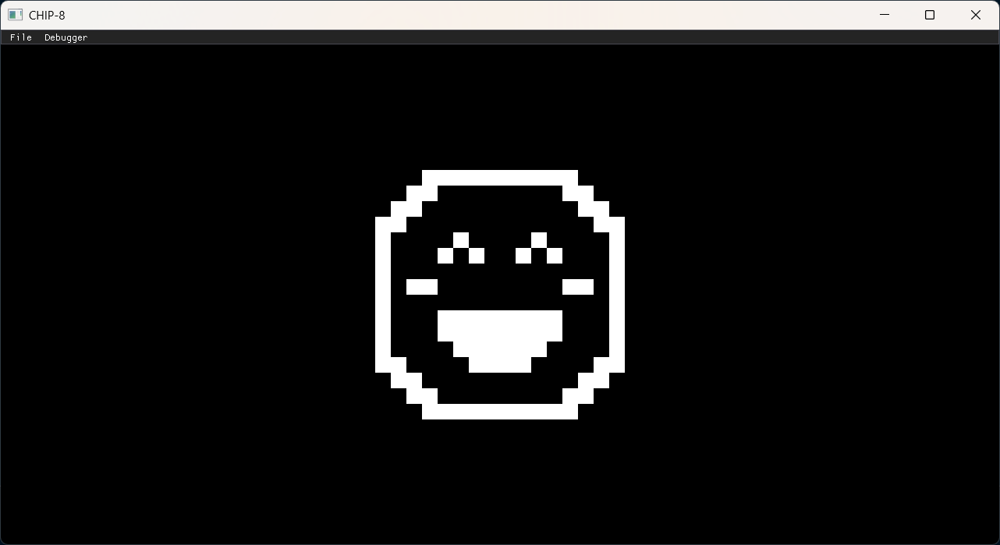
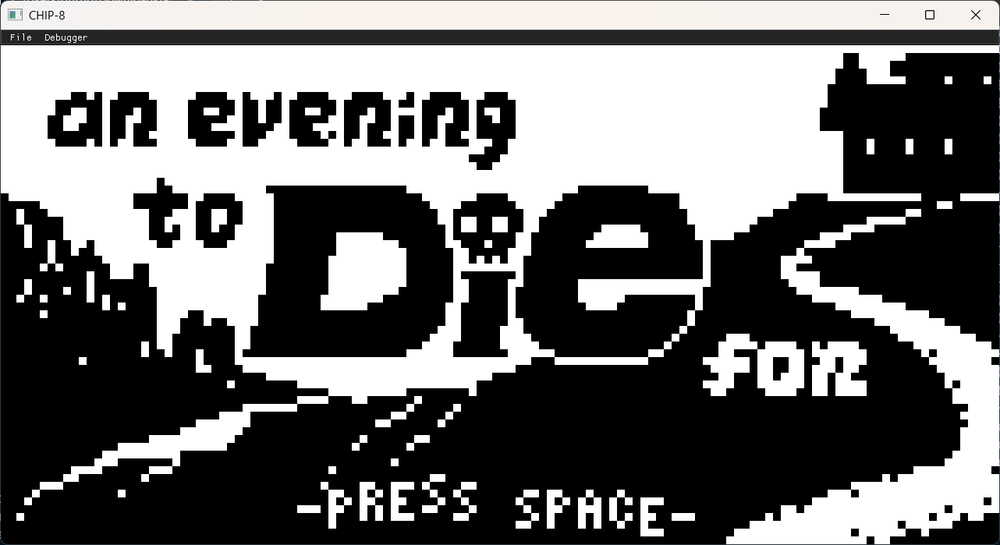
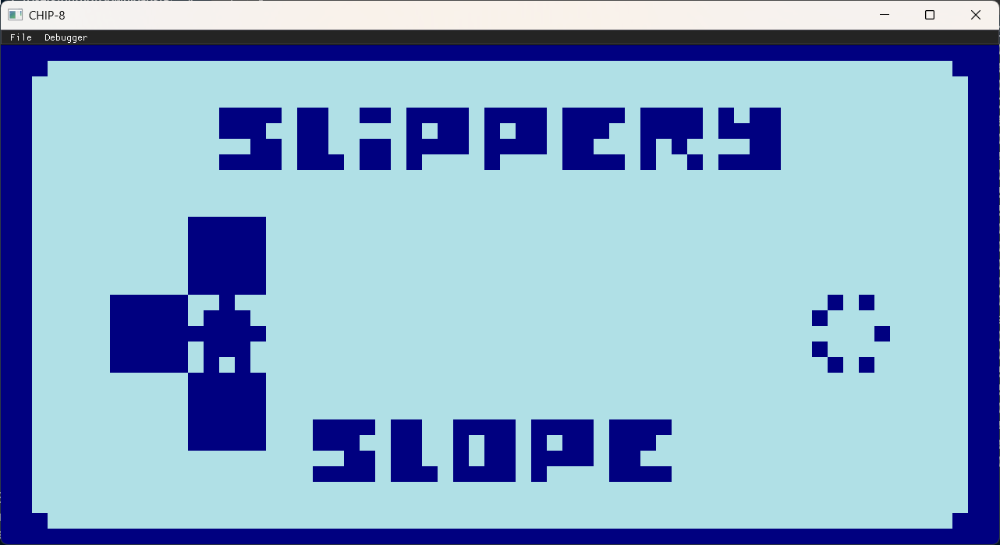

# NACHO

A Chip-8 emulator with support for Classic CHIP-8, Super CHIP-8, and XO-Chip programs.

| Startup Screen | "T8NKS" by your name here |
|-------|-------|
|  |  |

| "an evening to Die for" by JohnEarnest | "Slippery Slope" by JohnEarnest |
|-------|-------|
|  |  |


## Description

NACHO is fully written in C++ and uses GLFW + OpenGL for graphics.

## Features

* Supports Chip-8, Super-Chip, XO-Chip programs
* Set custom system configurations 
* Automatic configuration generator for select programs
* Save States
* Simple Debugger

## Getting Started

### Dependencies

* OpenGL 3.3 or higher
* CMake version 3.16 or higher
* Windows or Linux  

### Build 

* Simply run the commands below from the project's root directory: 
```
cmake -S . -B build
cmake --build build
```

### Executing program

On Linux:
```
./build/chip8
```

On Windows:
```
.\build\chip8
```
* Place programs you want to run on the emulator in the games directory of the project. (Create if it doesn't exist)
* Use the UI to select your game from the list and have fun! 

## Work In Progress 

* Add CRT effect to graphics 

## Authors

Gurnoor Bola - [Github](https://github.com/GurnoorBola)

## License

This project is licensed under the MIT License - see the [LICENSE.md](https://github.com/GurnoorBola/Chip-8-Interpreter/blob/main/LICENSE.md) file for details

## Acknowledgments

* https://tobiasvl.github.io/blog/write-a-chip-8-emulator/ - Great high-level CHIP-8 overview 
* https://chip8.gulrak.net/ - Collection of CHIP-8 opcode info
*  https://github.com/Timendus/chip8-test-suite - Compilation of CHIP-8 testing programs 
